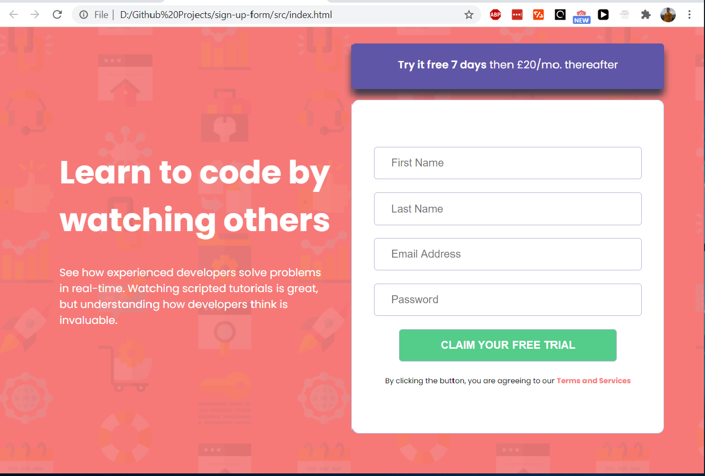
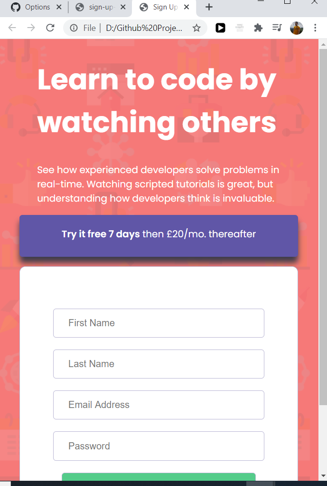

# sign-up-form

In this project I am trying to create a functional application based on a picture and some assets (images). 
I end up using new technologies like flexbox, clamp or media query for smaller screen resolution view ports.

Mobile view: 

